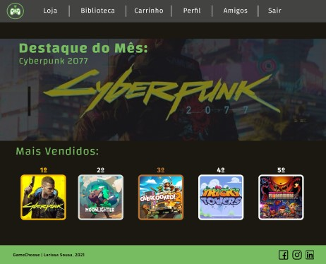
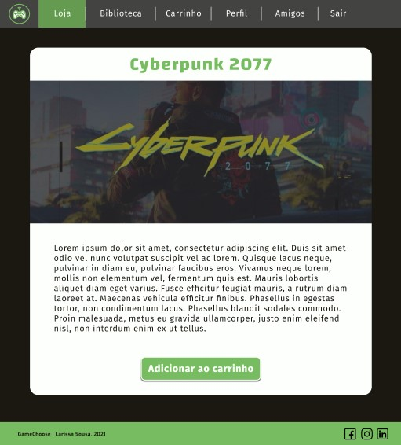
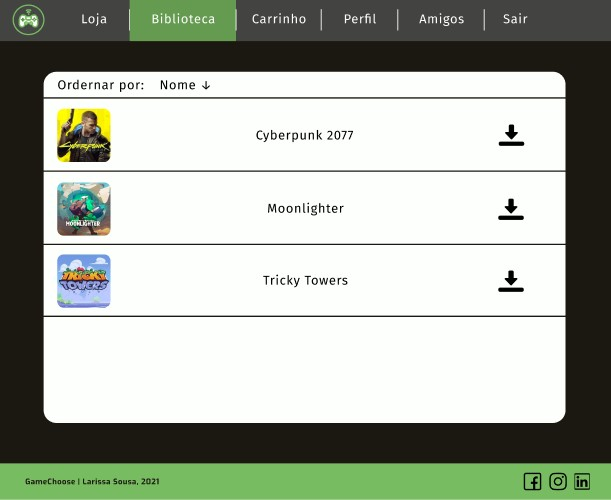
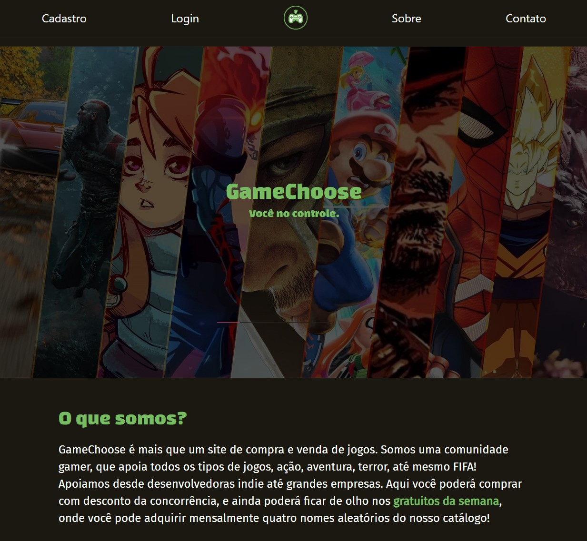
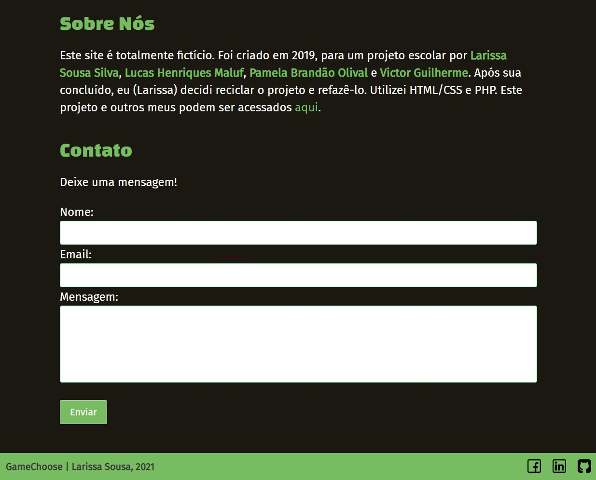
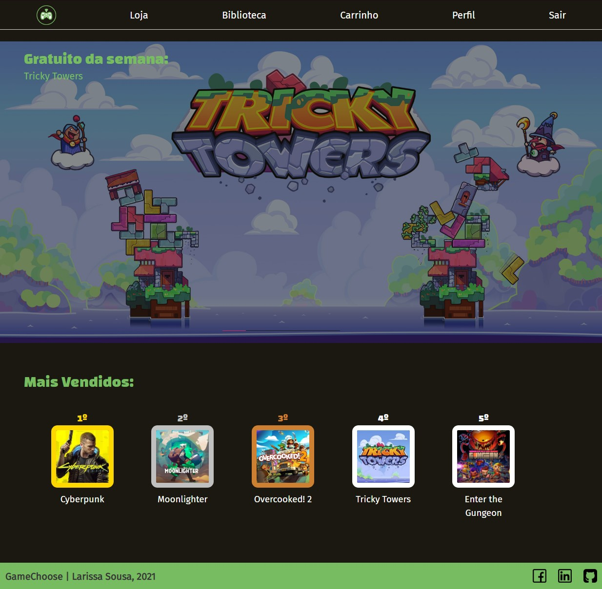
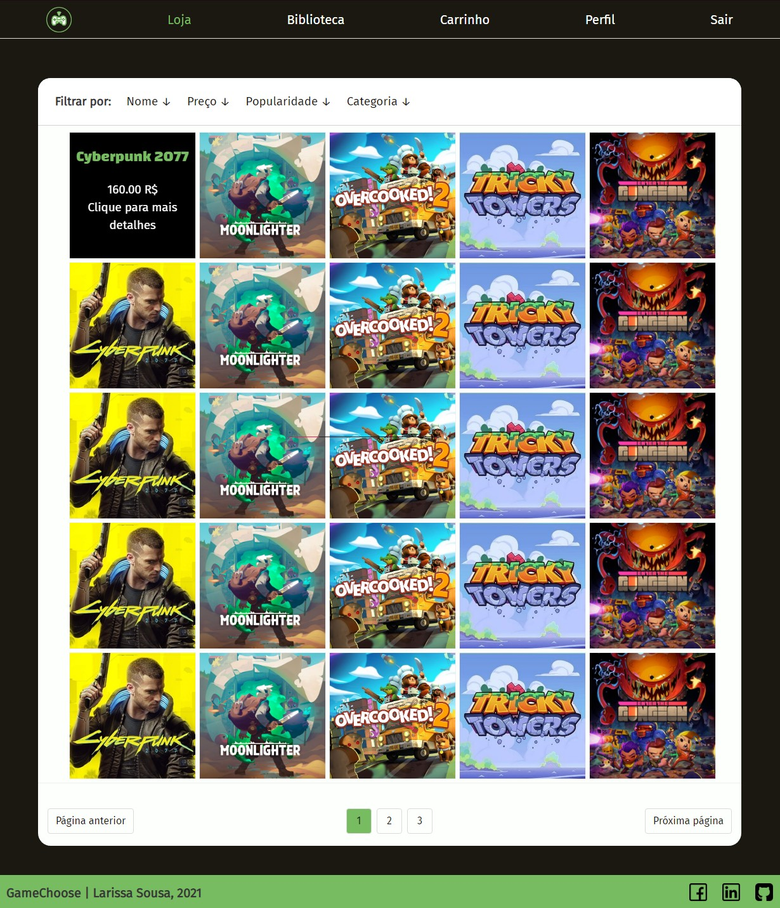

  
  
  

<h1 align="center">
  
</h1>

 
🚧 GameChoose 🎮| Em andamento 🚧

 <a href="#-sobre-o-projeto">Sobre o Projeto</a> •
 <a href="#-layout">Layout</a> • 
 <a href="#-tecnologias">Tecnologias</a> • 
 <a href="#-como-rodar">Como Rodar</a> •
 <a href="#-autora">Autora</a>

---

## 💾 Sobre o Projeto

  
GameChoose é um projeto escolar criado em 2019, por mim, Lucas Henriques Maluf, Pamela Brandão Olival e Victor Guilherme. Após ser concluído, decidi reciclar o projeto      e refazê-lo. Consiste em um sistema de compra de jogos online, assim como a Epic Games ou a Steam.

---

## 🎨 Layout

  
Todo o layout está disponível no Figma:

  
  
Um pouco do layout feito:

  
  

    
    
    
    
  

---

## 🛠 Tecnologias

  
As seguintes ferramentas foram usadas na construção do projeto:

  <ul>
    <li>HTML</li>
    <li>CSS</li>
    <li><a href="https://bulma.io">Bulma</a></li>
  </ul>

 

---

## 🚀 Como Rodar

  
Como o projeto ainda não está concluído, não está na web. Porém quando estiver concluído, irei postá-lo e realizar manutenções para mantê-lo ativo.

  
Aqui estão algumas telas:

  <h3>Tela Inicial:</h3>
  

  
  
   
  
  <h3>Início:</h3>
  

  
   
  
  <h3>Loja:</h3>
  

  
   

---

## 👩🏻‍💻 Autora

---

 
 
